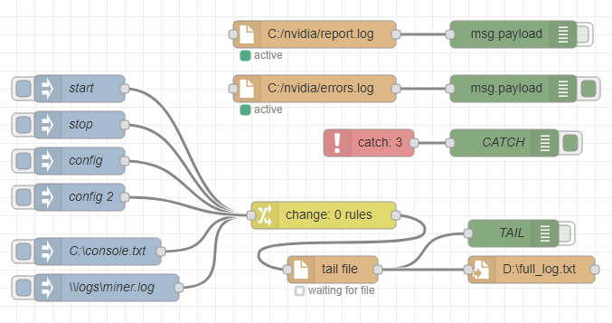

# node-red-contrib-tail-file
Node-RED Node: Tail for file **beta**

## Installation
From Node-RED:
```
Menu - Manage palette - Install - type "node-red-contrib-tail-file"
```
Install with npm:
```
(Linux) cd cd ~/.node-red
(Windows) cd c:\Users\<USER>\.node-red\
npm install node-red-contrib-tail-file
```

## Dependencies
Requires [paulmillr/**chokidar**](https://github.com/paulmillr/chokidar) (tested on v2.0.4)

## Description
**coming soon**

## Usage
**Inject**

You can send commands to `tail-file` in runtime.
For example, create `tail-file` node, then inject necessary parameters (in json format) with `inject` node.



**stop** tail:
```json
{
    "topic": "tail-file-stop"
}
```

**start** tail:
```json
{
    "topic": "tail-file-start"
}
```

**change** filename:
```json
{
    "topic": "tail-file-filename",
    "payload": "c:/new_file.log"
}
```

full **config** parameters:
```json
{
    "topic": "tail-file-config",
    "payload": {
        "filename": "c:/file.log",
        "createFile": false,
        "encoding": "utf-8",
        "mode": "",
        "split": true,
        "separator": "[\r]{0,1}\n",
        "fromBeginning": false,
        "flushAtEOF": false,
        "rememberLast": true,
        "lineBytes": 512,
        "limitSize": true,
        "maxBytes": 5120,
        "skipBlank": true,
        "useTrim": true,
        "sendError": false,
        "interval": 100,
        
        "chokidar": {
            "persistent": true,
            "ignoreInitial": true,
            "usePolling": true,
            "interval": 100,
            "binaryInterval": 300,
            "alwaysStat": true,
            "awaitWriteFinish": {
                "stabilityThreshold": 200,
                "pollInterval": 100
            },
            "ignorePermissionErrors": true,
            "atomic": true
        }
    }
}
```
